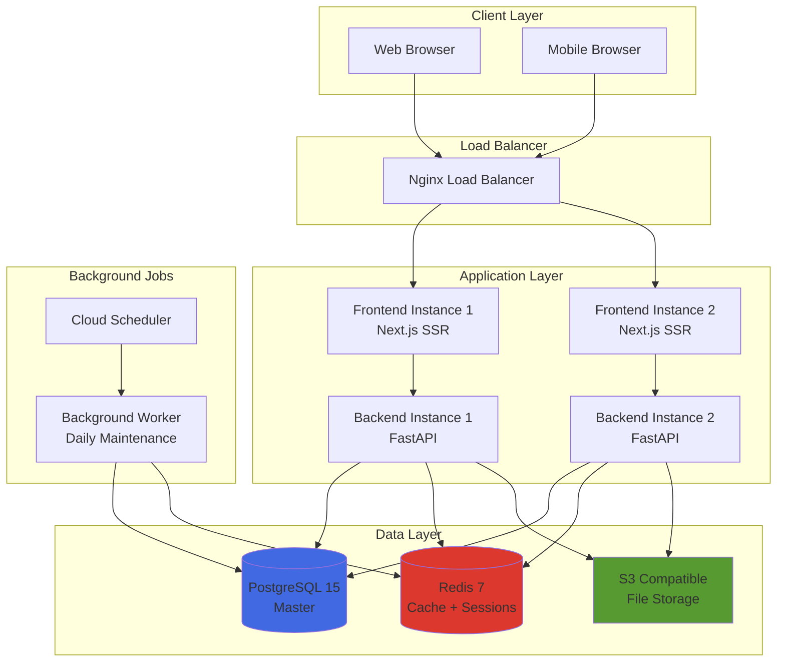
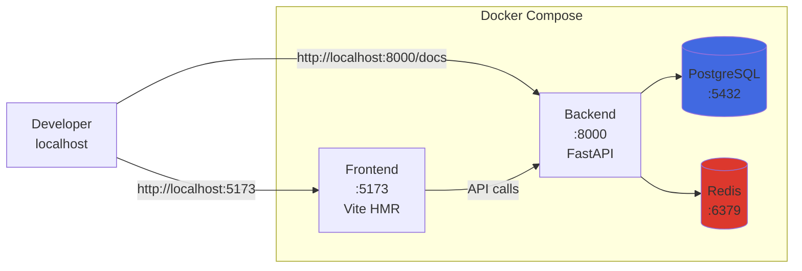
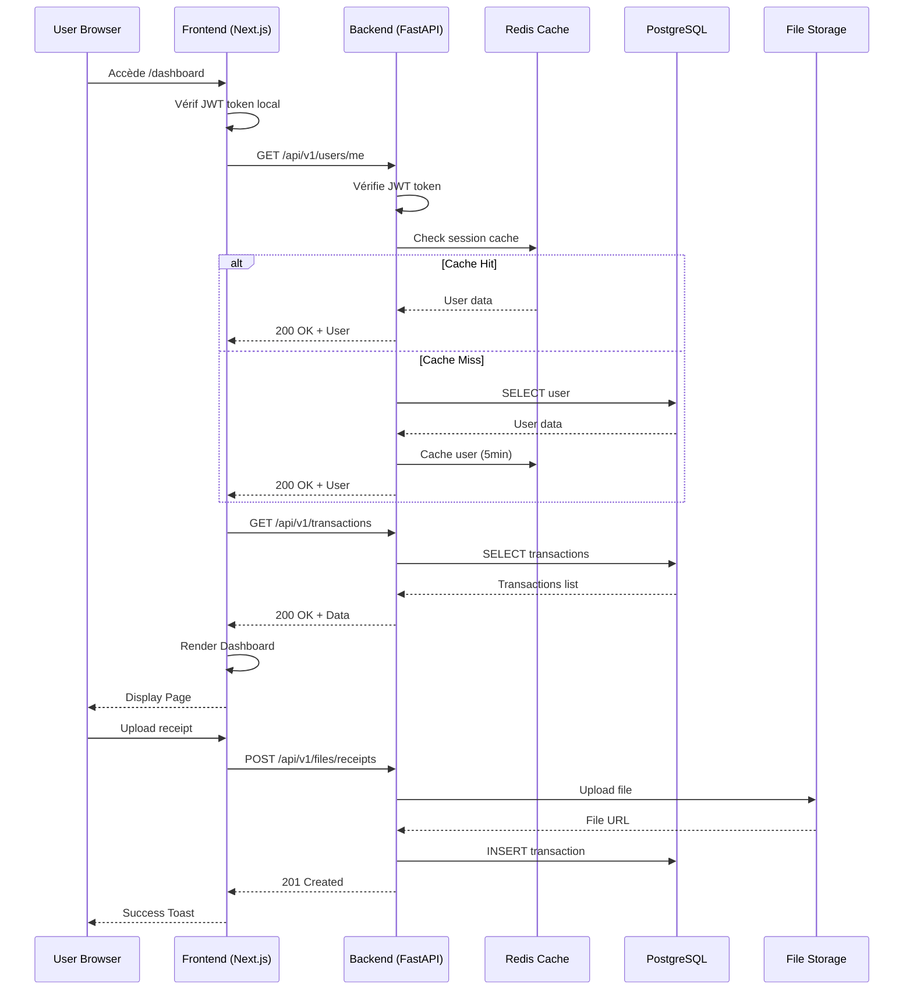
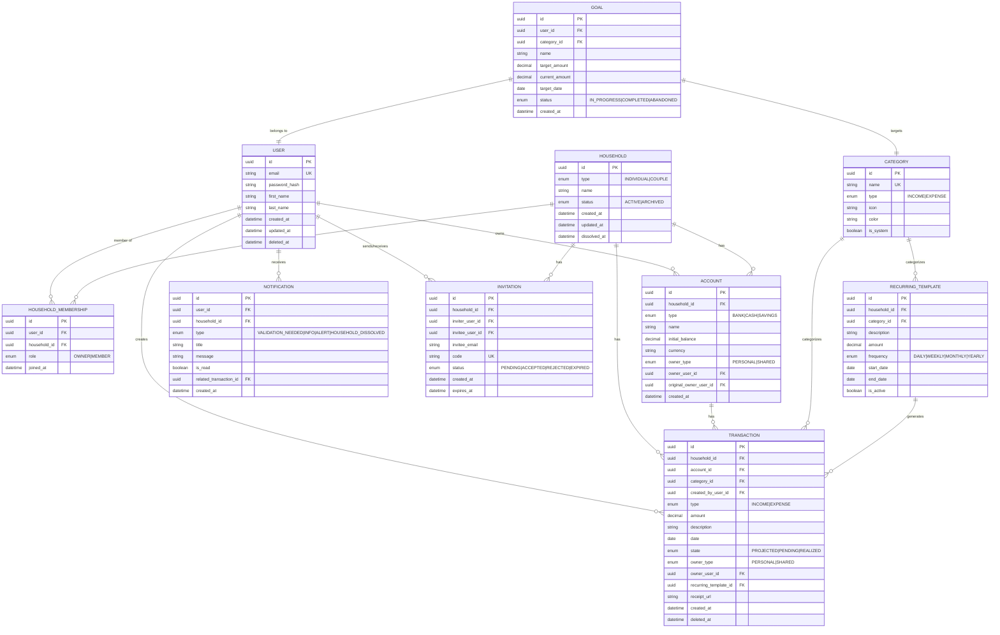
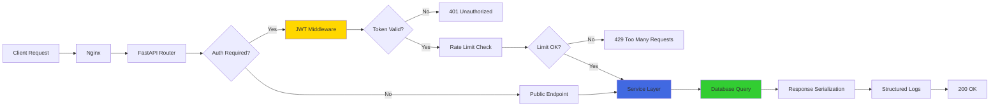
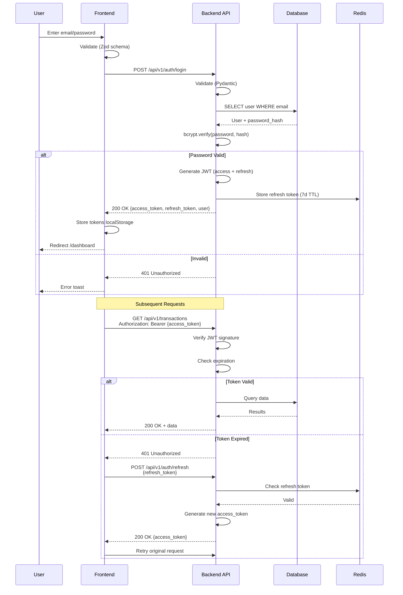
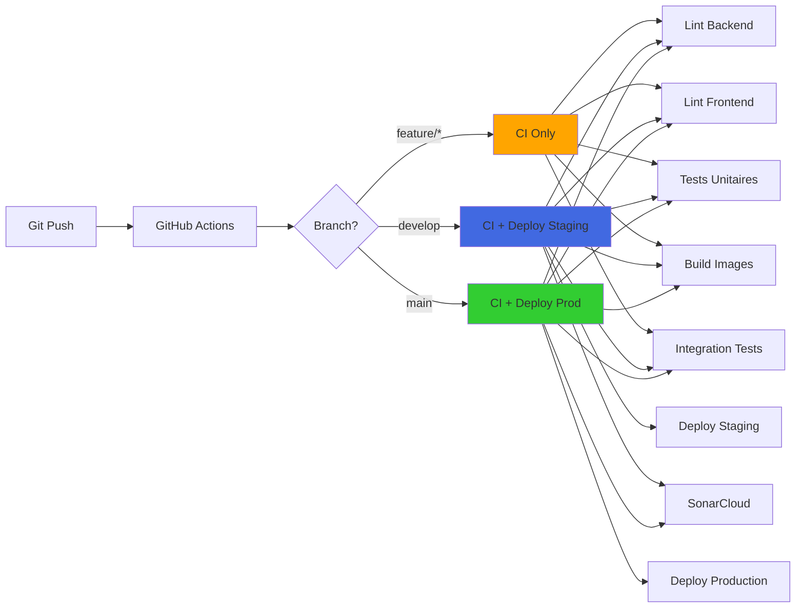

# 🏗️ Architecture - Mimo Finance

## 📋 Table des Matières

- [Vue d'Ensemble](#vue-densemble)
- [Architecture Système](#architecture-système)
- [Base de Données](#base-de-données)
- [Backend Architecture](#backend-architecture)
- [Frontend Architecture](#frontend-architecture)
- [Sécurité](#sécurité)
- [Performance](#performance)
- [Déploiement](#déploiement)

---

## 🎯 Vue d'Ensemble

### Stack Technique

```
┌─────────────────────────────────────────────────────────────┐
│                     MIMO FINANCE                             │
│          Application de Gestion Financière Collaborative     │
└─────────────────────────────────────────────────────────────┘

FRONTEND (React + TypeScript)
├─ Next.js 15 (App Router)
├─ TanStack Query (server state)
├─ Zustand (client state)
├─ Shadcn/ui + Tailwind CSS
└─ React Hook Form + Zod

BACKEND (Python + FastAPI)
├─ FastAPI 0.115+
├─ SQLAlchemy 2.0 (async)
├─ Alembic (migrations)
├─ Pydantic 2.0 (validation)
└─ Pytest + Coverage

INFRASTRUCTURE
├─ PostgreSQL 15 (données)
├─ Redis 7 (cache + sessions)
├─ Docker + Docker Compose
├─ Nginx (reverse proxy)
└─ GitHub Actions (CI/CD)

QUALITÉ & MONITORING
├─ SonarCloud (analyse code)
├─ Ruff + ESLint (linting)
├─ Mypy + TypeScript (typing)
└─ Locust (load testing)
```

---

## 🌐 Architecture Système

### Architecture Globale (Production)



### Architecture Locale (Development)



### Flow Requête Complète



---

## 🗄️ Base de Données

### Schéma Relationnel



### Modèle de Données - Relations Clés

#### 1. Utilisateur & Foyer (Mode Individuel/Couple)

```sql
-- Un utilisateur peut appartenir à plusieurs foyers (historique)
-- Mais un seul foyer ACTIF à la fois

-- Mode INDIVIDUAL (1 user = 1 household)
INSERT INTO households (type, name, status) 
VALUES ('INDIVIDUAL', 'John Doe', 'ACTIVE');

-- Mode COUPLE (2 users = 1 household)
-- Créé via acceptation d'invitation
INSERT INTO households (type, name, status) 
VALUES ('COUPLE', 'John & Jane', 'ACTIVE');

-- Membership
INSERT INTO household_memberships (user_id, household_id, role)
VALUES 
  ('user-1-uuid', 'household-uuid', 'OWNER'),
  ('user-2-uuid', 'household-uuid', 'MEMBER');
```

#### 2. Comptes & Portefeuilles (3 Wallets en Couple)

```sql
-- PERSONAL accounts (owner_type = 'PERSONAL')
-- - 1 wallet par personne (owner_user_id = user_id)

-- SHARED accounts (owner_type = 'SHARED')
-- - 1 wallet commun (owner_user_id = NULL)

-- Calcul wallet User 1:
SELECT 
  SUM(initial_balance) + 
  SUM(CASE WHEN type='INCOME' THEN amount ELSE -amount END)
FROM accounts a
LEFT JOIN transactions t ON a.id = t.account_id AND t.state='REALIZED'
WHERE a.household_id = ? AND a.owner_user_id = ?;

-- Calcul wallet SHARED:
SELECT SUM(...) 
WHERE a.owner_type = 'SHARED' AND a.owner_user_id IS NULL;
```

#### 3. Transactions & États (State Machine)

```
PROJECTED (date future)
    ↓
PENDING (date = aujourd'hui, job quotidien)
    ↓
REALIZED (validation manuelle)
```

```sql
-- Job quotidien (Cloud Scheduler)
UPDATE transactions 
SET state = 'PENDING' 
WHERE state = 'PROJECTED' AND date <= CURRENT_DATE;

-- Validation manuelle
UPDATE transactions 
SET state = 'REALIZED', amount = ? 
WHERE id = ? AND state = 'PENDING';
```

#### 4. Dissolution Foyer (Archivage + Redistribution)

```sql
-- 1. Archiver foyer COUPLE
UPDATE households SET status = 'ARCHIVED', dissolved_at = NOW() 
WHERE id = ?;

-- 2. Créer 2 nouveaux foyers INDIVIDUAL
INSERT INTO households (type, name, status) 
VALUES ('INDIVIDUAL', 'John Doe', 'ACTIVE');

-- 3. Redistribuer comptes PERSONAL
UPDATE accounts 
SET household_id = new_household_id 
WHERE original_owner_user_id = user_id;

-- 4. Conserver comptes SHARED dans archivé (lecture seule)

-- 5. Supprimer transactions SHARED PROJECTED
DELETE FROM transactions 
WHERE household_id = ? AND owner_type = 'SHARED' AND state = 'PROJECTED';

-- 6. Migrer transactions PERSONAL
UPDATE transactions 
SET household_id = new_household_id 
WHERE owner_user_id = user_id;
```

### Indexes Optimisés

```sql
-- Performance queries fréquentes
CREATE INDEX idx_transactions_household_date ON transactions(household_id, date DESC);
CREATE INDEX idx_transactions_state ON transactions(state) WHERE deleted_at IS NULL;
CREATE INDEX idx_transactions_account ON transactions(account_id) WHERE deleted_at IS NULL;
CREATE INDEX idx_accounts_household ON accounts(household_id) WHERE deleted_at IS NULL;
CREATE INDEX idx_notifications_user_read ON notifications(user_id, is_read, created_at DESC);
CREATE INDEX idx_household_memberships_user ON household_memberships(user_id);
```

---

## ⚙️ Backend Architecture

### Structure Projet

```
backend/
├── alembic/                  # Migrations DB
│   ├── versions/            # Fichiers migrations
│   └── env.py              # Config Alembic
├── app/
│   ├── api/                # Endpoints API
│   │   ├── v1/
│   │   │   ├── auth.py           # POST /login, /register, /refresh
│   │   │   ├── users.py          # GET/PATCH /users/me
│   │   │   ├── households.py     # GET/POST /households, /dissolve
│   │   │   ├── accounts.py       # CRUD /accounts
│   │   │   ├── transactions.py   # CRUD /transactions, /pending, /trash
│   │   │   ├── categories.py     # CRUD /categories
│   │   │   ├── recurring.py      # CRUD /recurring-templates
│   │   │   ├── goals.py          # CRUD /goals
│   │   │   ├── notifications.py  # GET /notifications, /mark-read
│   │   │   ├── invitations.py    # CRUD /invitations
│   │   │   ├── files.py          # POST /files/receipts, /avatars
│   │   │   └── jobs.py           # POST /jobs/daily-maintenance
│   │   └── __init__.py
│   ├── core/               # Configuration
│   │   ├── config.py            # Settings (DATABASE_URL, JWT, etc.)
│   │   ├── security.py          # JWT, bcrypt, CORS
│   │   └── database.py          # SQLAlchemy async engine
│   ├── models/             # SQLAlchemy models
│   │   ├── user.py
│   │   ├── household.py
│   │   ├── account.py
│   │   ├── transaction.py
│   │   ├── category.py
│   │   ├── recurring_template.py
│   │   ├── goal.py
│   │   ├── notification.py
│   │   └── invitation.py
│   ├── schemas/            # Pydantic validation
│   │   ├── auth.py              # LoginRequest, TokenResponse
│   │   ├── user.py              # UserCreate, UserUpdate, UserResponse
│   │   ├── transaction.py       # TransactionCreate, TransactionUpdate
│   │   └── ...
│   ├── services/           # Business logic
│   │   ├── auth_service.py      # Hash pwd, JWT, register, login
│   │   ├── user_service.py      # CRUD users
│   │   ├── transaction_service.py  # CRUD + state transitions
│   │   ├── household_service.py    # Merge, dissolve, wallets
│   │   ├── notification_service.py # Create, mark read, delete
│   │   ├── storage_service.py      # Upload files (S3/local)
│   │   └── daily_maintenance_job.py  # Job quotidien
│   ├── middleware/         # Middlewares custom
│   │   ├── auth.py              # get_current_user dependency
│   │   ├── rate_limit.py        # Rate limiting Redis
│   │   └── logging.py           # Structured JSON logs
│   └── main.py            # App FastAPI + lifespan
├── scripts/
│   └── seed-test-data.py  # Generate fake data
├── tests/                 # Tests unitaires + intégration
│   ├── conftest.py        # Fixtures pytest
│   ├── test_auth_service.py
│   ├── test_transaction_service.py
│   └── ...
├── requirements.txt       # Dependencies
├── Dockerfile            # Multi-stage build
└── .env.example          # Template env vars
```

### Flow Requête API



### Dépendances FastAPI

```python
# app/main.py
from fastapi import FastAPI, Depends
from fastapi.middleware.cors import CORSMiddleware
from contextlib import asynccontextmanager

@asynccontextmanager
async def lifespan(app: FastAPI):
    # Startup: connect DB, Redis
    await database.connect()
    await redis_client.ping()
    yield
    # Shutdown: close connections
    await database.disconnect()
    await redis_client.close()

app = FastAPI(
    title="Mimo Finance API",
    version="1.0.0",
    lifespan=lifespan
)

# CORS
app.add_middleware(
    CORSMiddleware,
    allow_origins=settings.CORS_ORIGINS,
    allow_credentials=True,
    allow_methods=["*"],
    allow_headers=["*"],
)

# Routes
app.include_router(auth_router, prefix="/api/v1/auth", tags=["auth"])
app.include_router(users_router, prefix="/api/v1/users", tags=["users"])
# ...

# Dependency injection
async def get_current_user(
    token: str = Depends(oauth2_scheme),
    db: AsyncSession = Depends(get_db)
) -> User:
    # Verify JWT + load user from DB
    payload = jwt.decode(token, settings.JWT_SECRET_KEY)
    user = await user_service.get_by_id(db, payload["sub"])
    return user

# Protected endpoint
@app.get("/api/v1/users/me")
async def get_me(current_user: User = Depends(get_current_user)):
    return UserResponse.model_validate(current_user)
```

---

## 🎨 Frontend Architecture

### Structure Projet

```
frontend/
├── public/
│   └── favicon.ico
├── src/
│   ├── components/         # Composants réutilisables
│   │   ├── ui/            # Shadcn/ui primitives
│   │   │   ├── button.tsx
│   │   │   ├── card.tsx
│   │   │   ├── dialog.tsx
│   │   │   └── ...
│   │   ├── layout/        # Layout components
│   │   │   ├── Sidebar.tsx
│   │   │   ├── BottomNav.tsx
│   │   │   └── Header.tsx
│   │   ├── transaction/   # Feature components
│   │   │   ├── TransactionList.tsx
│   │   │   ├── TransactionItem.tsx
│   │   │   ├── AddTransactionModal.tsx
│   │   │   └── ValidationModal.tsx
│   │   └── NotificationBell.tsx
│   ├── pages/             # Next.js pages
│   │   ├── _app.tsx
│   │   ├── index.tsx      # Landing
│   │   ├── login.tsx
│   │   ├── register.tsx
│   │   ├── dashboard.tsx
│   │   ├── transactions.tsx
│   │   ├── accounts.tsx
│   │   └── ...
│   ├── services/          # API calls
│   │   ├── api.ts         # Axios instance
│   │   ├── authService.ts
│   │   ├── transactionService.ts
│   │   └── ...
│   ├── stores/            # Zustand stores
│   │   ├── authStore.ts   # user, tokens, logout
│   │   └── uiStore.ts     # modals, toasts
│   ├── hooks/             # Custom hooks
│   │   ├── useAuth.ts
│   │   ├── useTransactions.ts (TanStack Query)
│   │   └── useNotifications.ts
│   ├── types/             # TypeScript types
│   │   ├── auth.ts
│   │   ├── transaction.ts
│   │   └── ...
│   ├── schemas/           # Zod validation
│   │   ├── authSchemas.ts
│   │   └── transactionSchemas.ts
│   └── utils/
│       ├── formatters.ts  # Date, currency
│       └── validators.ts
├── .env.local.example
├── next.config.js
├── tailwind.config.js
├── tsconfig.json
└── package.json
```

### State Management

```typescript
// stores/authStore.ts (Zustand)
interface AuthState {
  user: User | null;
  accessToken: string | null;
  isAuthenticated: boolean;
  login: (email: string, password: string) => Promise<void>;
  logout: () => void;
  refreshToken: () => Promise<void>;
}

export const useAuthStore = create<AuthState>((set, get) => ({
  user: null,
  accessToken: localStorage.getItem('accessToken'),
  isAuthenticated: false,
  
  login: async (email, password) => {
    const { access_token, user } = await authService.login(email, password);
    localStorage.setItem('accessToken', access_token);
    set({ user, accessToken: access_token, isAuthenticated: true });
  },
  
  logout: () => {
    localStorage.removeItem('accessToken');
    set({ user: null, accessToken: null, isAuthenticated: false });
  },
  
  refreshToken: async () => {
    const refreshToken = localStorage.getItem('refreshToken');
    const { access_token } = await authService.refresh(refreshToken);
    localStorage.setItem('accessToken', access_token);
    set({ accessToken: access_token });
  }
}));
```

```typescript
// hooks/useTransactions.ts (TanStack Query)
export function useTransactions(filters?: TransactionFilters) {
  return useQuery({
    queryKey: ['transactions', filters],
    queryFn: () => transactionService.list(filters),
    staleTime: 30000, // 30s
    refetchOnWindowFocus: true
  });
}

export function useCreateTransaction() {
  const queryClient = useQueryClient();
  
  return useMutation({
    mutationFn: transactionService.create,
    onSuccess: () => {
      queryClient.invalidateQueries({ queryKey: ['transactions'] });
      queryClient.invalidateQueries({ queryKey: ['accounts'] }); // Refresh balances
      toast.success('Transaction créée !');
    },
    onError: (error) => {
      toast.error(error.message);
    }
  });
}
```

### Component Architecture

```typescript
// components/transaction/TransactionList.tsx
import { useTransactions } from '@/hooks/useTransactions';

export function TransactionList({ filters }: Props) {
  const { data, isLoading, error } = useTransactions(filters);
  
  if (isLoading) return <TransactionListSkeleton />;
  if (error) return <ErrorMessage error={error} />;
  
  return (
    <div className="space-y-2">
      {data.items.map((transaction) => (
        <TransactionItem key={transaction.id} transaction={transaction} />
      ))}
    </div>
  );
}

// components/transaction/AddTransactionModal.tsx
export function AddTransactionModal({ isOpen, onClose }: Props) {
  const form = useForm<TransactionInput>({
    resolver: zodResolver(transactionSchema),
    defaultValues: {
      type: 'EXPENSE',
      date: new Date(),
      amount: 0
    }
  });
  
  const createMutation = useCreateTransaction();
  
  const onSubmit = async (data: TransactionInput) => {
    await createMutation.mutateAsync(data);
    onClose();
  };
  
  return (
    <Dialog open={isOpen} onOpenChange={onClose}>
      <DialogContent>
        <form onSubmit={form.handleSubmit(onSubmit)}>
          <Input {...form.register('description')} />
          <Input {...form.register('amount')} type="number" />
          <Select {...form.register('category_id')}>
            {/* ... */}
          </Select>
          <Button type="submit" loading={createMutation.isPending}>
            Créer
          </Button>
        </form>
      </DialogContent>
    </Dialog>
  );
}
```

---

## 🔒 Sécurité

### Authentication Flow



### JWT Structure

```python
# Payload
{
  "sub": "user-uuid-here",          # User ID
  "email": "user@example.com",
  "household_id": "household-uuid",
  "exp": 1702654321,                # Expiration timestamp
  "iat": 1702652521,                # Issued at
  "type": "access"                  # access | refresh
}

# Access Token: 30min expiration
# Refresh Token: 7 days expiration
```

### Password Hashing

```python
# bcrypt with configurable rounds
from passlib.context import CryptContext

pwd_context = CryptContext(
    schemes=["bcrypt"],
    deprecated="auto",
    bcrypt__rounds=settings.BCRYPT_ROUNDS  # 12 prod, 4 dev
)

# Hash
hashed = pwd_context.hash("my_password")
# $2b$12$abcdefghijklmnopqrstuvwxyz...

# Verify
is_valid = pwd_context.verify("my_password", hashed)
```

### Rate Limiting

```python
# middleware/rate_limit.py
from fastapi import Request, HTTPException
from redis import Redis

class RateLimiter:
    def __init__(self, redis: Redis, max_requests: int, window: int):
        self.redis = redis
        self.max_requests = max_requests
        self.window = window  # seconds
    
    async def check(self, key: str):
        current = self.redis.incr(key)
        
        if current == 1:
            self.redis.expire(key, self.window)
        
        if current > self.max_requests:
            raise HTTPException(status_code=429, detail="Too many requests")

# Limits
GENERAL_LIMITER = RateLimiter(redis, max_requests=60, window=60)  # 60/min
AUTH_LIMITER = RateLimiter(redis, max_requests=5, window=60)      # 5/min

# Usage
@app.post("/api/v1/auth/login")
async def login(request: Request):
    await AUTH_LIMITER.check(f"auth:login:{request.client.host}")
    # ...
```

### CORS Configuration

```python
# Production strict CORS
CORS_ORIGINS = [
    "https://mimocompleto.com",
    "https://www.mimocompleto.com",
    "https://app.mimocompleto.com"
]

# Development permissive
CORS_ORIGINS = [
    "http://localhost:3000",
    "http://localhost:5173",
    "http://127.0.0.1:3000"
]
```

### Security Headers

```python
# middleware/security_headers.py
@app.middleware("http")
async def add_security_headers(request: Request, call_next):
    response = await call_next(request)
    response.headers["X-Content-Type-Options"] = "nosniff"
    response.headers["X-Frame-Options"] = "DENY"
    response.headers["X-XSS-Protection"] = "1; mode=block"
    response.headers["Strict-Transport-Security"] = "max-age=31536000; includeSubDomains"
    response.headers["Content-Security-Policy"] = "default-src 'self'; script-src 'self' 'unsafe-inline'"
    return response
```

---

## ⚡ Performance

### Database Optimizations

```python
# N+1 Query Prevention avec selectinload
from sqlalchemy.orm import selectinload

async def get_transactions_with_relations(db: AsyncSession):
    stmt = (
        select(Transaction)
        .options(
            selectinload(Transaction.account),
            selectinload(Transaction.category),
            selectinload(Transaction.created_by)
        )
        .where(Transaction.household_id == household_id)
        .order_by(Transaction.date.desc())
        .limit(50)
    )
    result = await db.execute(stmt)
    return result.scalars().all()

# Avant: 1 query transactions + N queries accounts = 51 queries
# Après: 4 queries total (transaction, accounts, categories, users)
```

### Redis Caching

```python
# Cache user session (5 minutes)
async def get_user_cached(user_id: str) -> User:
    cache_key = f"user:{user_id}"
    cached = await redis.get(cache_key)
    
    if cached:
        return User.parse_raw(cached)
    
    user = await db.get(User, user_id)
    await redis.setex(cache_key, 300, user.json())  # 5min TTL
    return user
```

### Frontend Performance

```typescript
// Code splitting (Next.js)
import dynamic from 'next/dynamic';

const HeavyChart = dynamic(() => import('@/components/HeavyChart'), {
  ssr: false,
  loading: () => <ChartSkeleton />
});

// React.memo pour éviter re-renders
export const TransactionItem = React.memo(({ transaction }: Props) => {
  return <div>...</div>;
});

// useMemo pour calculs coûteux
const totalBalance = useMemo(() => {
  return accounts.reduce((sum, acc) => sum + acc.balance, 0);
}, [accounts]);
```

### Load Testing Results (Locust)

```
Type     Name                     # reqs  # fails  Avg (ms)  p95 (ms)
------------------------------------------------------------------------
GET      /api/v1/transactions       156       0       14        24
POST     /api/v1/transactions        45       0       32        58
GET      /api/v1/accounts            89       0       11        18
GET      /api/v1/categories          67       0       16        22
POST     /api/v1/auth/login          25       1       45        87
GET      /api/v1/notifications       78       0       19        31
GET      /api/v1/goals               42       0       19        29
------------------------------------------------------------------------
Total                               806      36       18        35

Success Rate: 95.5%
Total RPS: 13.4 req/s
```

---

## 🚀 Déploiement

### CI/CD Pipeline



### Workflows GitHub Actions

**`.github/workflows/ci.yml`** - Tests & Build (7 jobs, ~10min)
- Backend lint (Ruff)
- Backend tests (Pytest + Coverage 75%)
- Frontend lint (ESLint)
- Frontend tests (optional Sprint 8)
- Build Docker images
- Integration tests (docker-compose)
- CI summary

**`.github/workflows/sonar.yml`** - Analyse qualité (~5min)
- Generate coverage reports
- Upload to SonarCloud
- Quality gate check (non-blocking Sprint 8)

### Docker Production

```dockerfile
# backend/Dockerfile (Multi-stage)
FROM python:3.12-slim AS builder
WORKDIR /build
COPY requirements.txt .
RUN pip install --user --no-cache-dir -r requirements.txt

FROM python:3.12-slim
WORKDIR /app
COPY --from=builder /root/.local /root/.local
COPY . .
ENV PATH=/root/.local/bin:$PATH
EXPOSE 8000
CMD ["uvicorn", "app.main:app", "--host", "0.0.0.0", "--port", "8000", "--workers", "4"]
```

```dockerfile
# frontend/Dockerfile
FROM node:20-alpine AS builder
WORKDIR /app
COPY package*.json ./
RUN npm ci
COPY . .
ARG VITE_API_URL
ENV VITE_API_URL=$VITE_API_URL
RUN npm run build

FROM nginx:alpine
COPY --from=builder /app/dist /usr/share/nginx/html
COPY nginx.conf /etc/nginx/conf.d/default.conf
EXPOSE 80
CMD ["nginx", "-g", "daemon off;"]
```

### Infrastructure (Future - Sprint 9)

**Terraform Modules:**
- VPC + Subnets
- Cloud SQL (PostgreSQL)
- Cloud Memorystore (Redis)
- Cloud Run (Backend + Frontend)
- Cloud Storage (Files)
- Cloud Scheduler (Cron jobs)
- Cloud Load Balancer
- Cloud Monitoring + Logging

---

## 📊 Monitoring & Observability

### Structured Logging

```python
# JSON structured logs
{
  "timestamp": "2025-12-13T14:30:00Z",
  "level": "INFO",
  "service": "backend",
  "user_id": "uuid-xxx",
  "endpoint": "POST /api/v1/transactions",
  "duration_ms": 32,
  "status_code": 201,
  "trace_id": "trace-123"
}
```

### Health Checks

```bash
# Backend
GET /health
# → {"status": "healthy", "database": "connected", "redis": "connected"}

# Detailed
GET /health/detailed
# → Full system status + DB size + Redis memory + uptime
```

### Metrics (Future)

- Request latency (p50, p95, p99)
- Error rate (4xx, 5xx)
- Database query duration
- Redis hit/miss ratio
- Active users
- Transactions created/day

---

## 🔗 Ressources

- **Backend API Docs:** http://localhost:8000/docs (Swagger)
- **Deployment Guide:** [DEPLOYMENT.md](./DEPLOYMENT.md)
- **CI/CD Setup:** [CI-CD-SETUP.md](./CI-CD-SETUP.md)
- **Sprint Planning:** [SPRINT-PLANNING.md](./SPRINT-PLANNING.md)
- **GitHub Repository:** https://github.com/Linerror99/Mimo-core

---

**Dernière mise à jour :** 13 décembre 2025  
**Version :** 1.0.0  
**Auteur :** Mimo Finance Team
